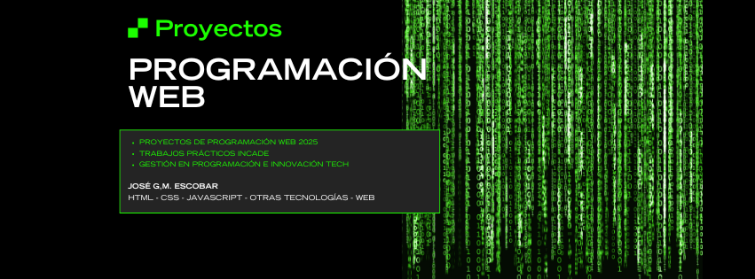

# Programación Web - Proyecto de Cátedra

Este repositorio corresponde a la materia **Programación Web**, donde a lo largo del cuatrimestre desarrollaremos diferentes proyectos prácticos orientados al **Desarrollo Web**.

## Objetivo

Aplicar los conceptos aprendidos en clase para crear proyectos utilizando **HTML, CSS, JavaScript** y otras tecnologías vistas durante el curso.

## Contenido

- Prácticas y ejercicios de la materia
- Proyectos individuales y grupales
- Documentación de los trabajos

---

📚 **Materia:** Programación Web  
👨‍💻 **Autor:** José G.M. Escobar
🎓 **Año:** 2025 GPI - INCADE
